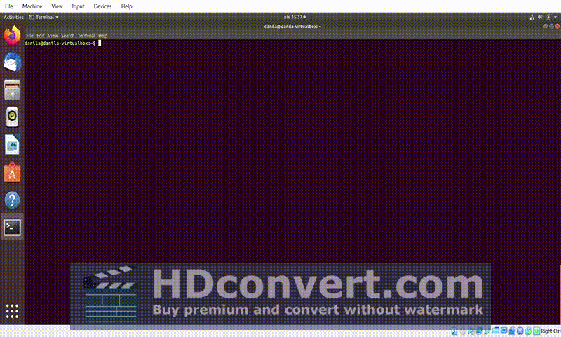

# Microshell 

The task is to use the ANSI C language to write a simple shell program – **Microshell**

## Table of content

- [Run](#run)
- [Supported commands](#supported-commands)
- [Demonstration](#demonstration-of-functionality-of-microshell-program)

## Run

To run program on *Linux* use make command and then run the showed file like that:

```bash
$ make
$ ./microshell.c
```
## Supported-commands 

> Also can be seen by typing `help` while running

* `help`  - displays on the screen information about the program author and offered functionalities
* `cd` 
* `exit` - exit the program
* `cp`,`rm`
* `chcolour` - let you choose the colour of text
* `whoami` - shows user name

## Demonstration-of-functionality-of-microshell-program

-----


 
